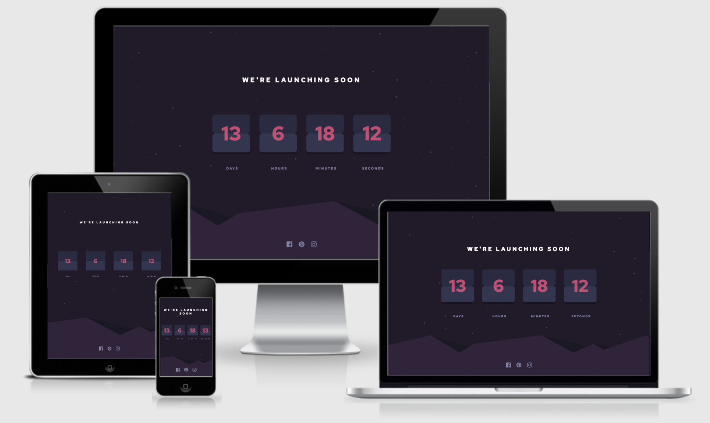

# Frontend Mentor - Launch countdown timer solution

This is a solution to the [Launch countdown timer challenge on Frontend Mentor](https://www.frontendmentor.io/challenges/launch-countdown-timer-N0XkGfyz-). Frontend Mentor challenges help you improve your coding skills by building realistic projects.

## Overview

### The challenge

Users should be able to:

- See hover states for all interactive elements on the page
- See a live countdown timer that ticks down every second (start the count at 14 days)
- **Bonus**: When a number changes, make the card flip from the middle

### Screenshot

### Links

- [Live site](https://jjpickering10.github.io/Frontend-Mentor-launch-countdown-timer-main/)

## My process

### Built with

- Semantic HTML5 markup
- SCSS
- Flexbox
- JS
- Mobile-first workflow

### Continued development

Continue Frontend Mentor challenges

## Author

- Frontend Mentor - [jjpickering10](https://www.frontendmentor.io/profile/jjpickering10)
